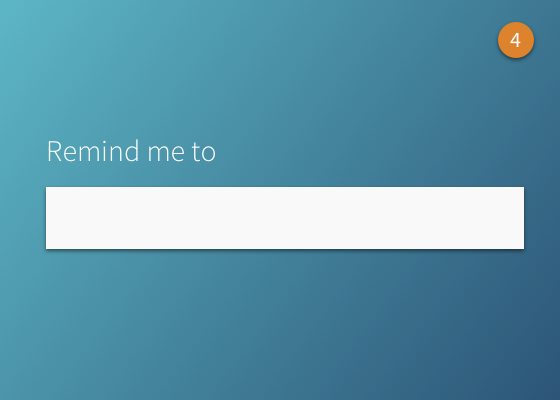
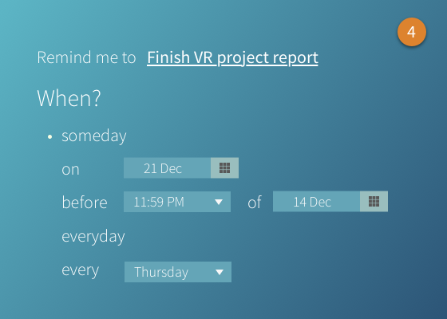
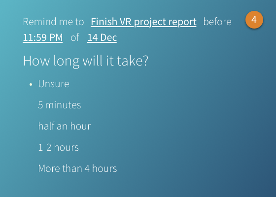
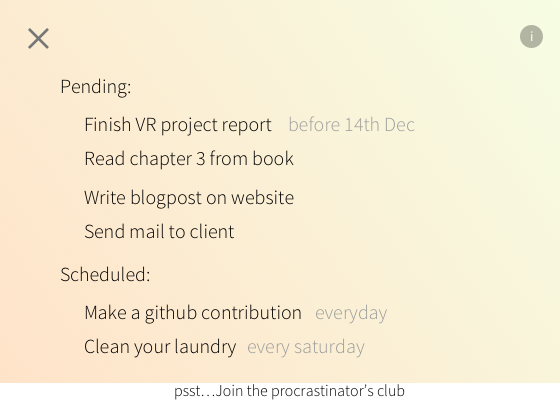
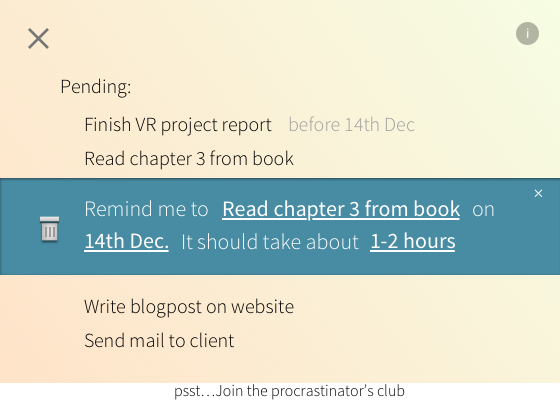
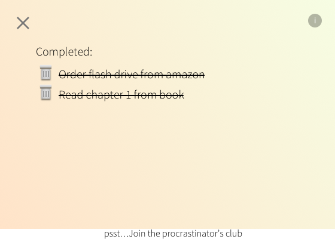
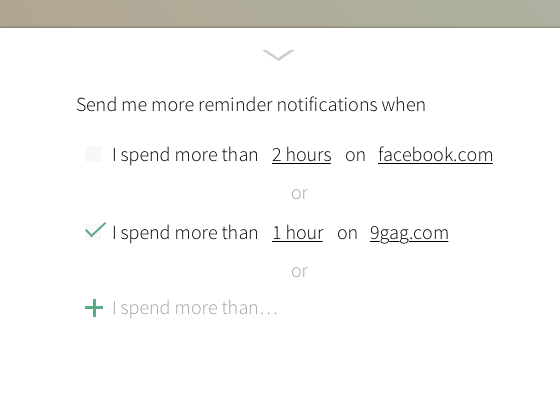

_Remind me to_ is a chrome extension for keeping track of a users tasks and sending useful notification alerts to remind them to complete a task whenever they are wasting time on the internet.

The app is __in design stage__. Here are a few concepts of what the application _should_ look like.

Initial screen when the user clicks on the extension inside the browser

On pressing enter, the extension asks for preferences for when the reminder notification should be made

Pressing enter again, the extension asks approximate duration after which point the task is saved (as indicated in the top right corner circle)

Clicking the top left bubble reveals all the tasks that are pending and scheduled

Tasks can be inspected and edited from within by clicking on them

Completed tasks are sent to the completed bucket from where they can be removed

By joining the procrastinator's club, the app sends more notification during user's unproductive hours
